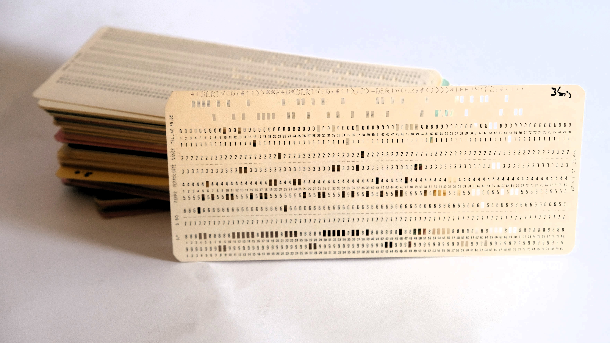

Certaines personnes parlent en Français, en Anglais, en Espagnol ou tout un tas d'autres langues. Les ordinateurs, c'est exactement pareil, ils ont leurs propres langages, qu'on appelle des **langages informatiques**. C'est que tu vas apprendre à utiliser pour coder.

## 0 et 1, la langue natale de ton ordinateur.

On a vu le binaire dans les articles précédents, c'est le langage de naissance des ordinateurs. Tous les langages informatiques du monde doivent être traduits en binaire pour que l'ordinateur les comprenne. Ce n'est pas vraiment un langage informatique, car nous ne codons pas en binaire (on pourrait, mais ce serait très compliqué et terriblement long !). C'est un programme qui s'appelle le **compilateur** ou **l'interprêteur** qui va s'occuper de traduire notre code en binaire pour l'ordinateur. Ouf, parce que si on devait le faire nous-même, ce serait vraiment pénible !

Par exemple, rien que pour faire une addition, on devrait écrire quelque chose comme ça :
10111000 00000001 00000010  

😱

## Les cartes perforées, les mamies du code

Il y a très très longtemps, les programmeurs et les programmeuses utilisaient des cartes perforées, qui étaient une forme de langage binaire. Chaque carte était un morceau de carton avec des trous à des endroits précis. Ces trous représentaient des informations que la machine pouvait lire.

Un trou = 1 (on lit une information)
Pas de trou = 0 (on ne lit rien)

Les cartes perforées étaient donc une manière d'écrire des instructions pour faire des programmes, ou de stocker des données sous forme binaire, bien avant les disques durs ! Ce sont les ancètres du code informatique qu'on utilise aujourd'hui.

Les cartes perforées ont été utilisées jusque dans les années 1980, pour programmer les premiers ordinateurs.

## Et aujourd'hui ?

Aujourd'hui, il existe des centaines de langages. Impossible de te dire le nombre exact, ça change tout le temps ! Mais tous ne sont pas aussi utilisés. Certains sont très réputés, et la grande majorité des développeuses et des développeurs les connaissent, comme Python, Javascript ou HTML. Ils permettent d'écrire des instructions d'une manière qui est très facile à comprendre pour les humains, et qui seront ensuite traduits automatiquement en binaire pour l'ordinateur.

Il en existe de très rigolos, qui ne sont pas vraiment fait pour coder mais plutôt pour expérimenter et s'amuser, comme MewMew (qui se prononce "miou miou"), qui est fait pour coder en langage de chat 😺 C'est très drôle, mais pas du tout utilisable !

Chaque langage à sa spécialité. Certains langages sont faits pour parler aux robots, d'autres pour créer des jeux, des sites web ou des applications. Pour créer ton premier site internet, tu vas surtout t'intéresser au HTML5 (pour faire le squelette de ta page) et au CSS3 (pour faire la décoration). Si tu veux animer des choses, faire des jeux, il faudra apprendre aussi le Javascript. Par exemple, pour que tu puisses dessiner sur le fond de la page, j'ai utilisé du Javascript. On peut faire des choses très amusantes avec, mais c'est un petit peu plus compliqué que le HTML et le CSS.

Si tu voulais coder un robot, tu t'intéresserais plutôt à Python. Certains robots comprennent aussi le Javascript.

## J'ai pas envie d'écrire, mais je veux coder quand même !

Tu peux tout à fait coder sans écrire ! Il existe plusieurs langages pour faire de la programmation basée sur des blocs.Tu peux utiliser ces blocs pour programmer tes instructions, ce sont comme des petites tuiles qui s'accrochent entre elles comme les pièces d'un puzzle. Scratch te permet de faire ceci, mais ce n'est pas le seul ! Blocky, Tinker ou Makecode sont aussi très connus. Tu peux trouver plusieurs jeux qui te proposent ce genre de programmation en blocs dans les ressources du site (dans le menu tout en haut de la page => "ressources", puis choisis l'onglet "jeux"). Mon préféré, c'est le music lab, qui te permet de coder de la musique avec des blocs. Vraiment génial !

## Qu'est ce qu'on va apprendre ici ?

Je voudrais surtout te proposer du **HTML**, du **CSS** et du **Javascript**, pour coder ton site internet et des petits jeux dans ton navigateur. Ce sont des langages que je connais très bien, je les utilise tous les jours dans mon travail. Et ce sont les langages sur lesquels on me pose beaucoup de questions, car il y a très peu de contenu adapté aux enfants qui ont envie de coder avec ces technologies. 

On va aussi apprendre a utiliser **les outils** autour du code. Et puis on fera peut être aussi d'autres langages, comme du **Python** ou du **Scratch**.

## De quoi ai-je besoin pour apprendre à coder ?

Si tu as un ordinateur, c'est suffisant ! Les outils dont on va parler ici sont tous gratuits. Il est possible qu'on s'amuse de temps en temps avec un robot ou un bras robotisé. Si tu n'as pas de robot chez toi, tu peux utiliser des outils qu'on appelle des "simulateurs", comme [VEXcode VR](https://vr.vex.com/) que tu peux utiliser en ligne, ou [Webots](https://cyberbotics.com/#webots), qui se télécharge sur ton ordinateur. Ils te permettent de programmer un robot directement sur ton ordinateur, même si tu n'as pas de robot !

## Il y a beaucoup d'Anglais 😱

Oui, dans l'informatique, on utilise beaucoup d'Anglais car c'est une des langues les plus parlées dans le monde. Beaucoup de développeurs et développeuses codent en Anglais, pour s'assurer que tout le monde, quelle que soit sa langue, puisse comprendre leur code. Mais pour commencer, tu n'as vraiment pas besoin de savoir parler Anglais. Par contre, ça peut être une super motivation pour apprendre, si ça t'intéresse ! L'Anglais te servira toujours dans l'informatique.

Ici, quand j'utiliserais des mots Anglais, je te les traduirais en Français pour que tu comprenne bien, et peut être que tu apprendra des mots d'Anglais en même temps ?