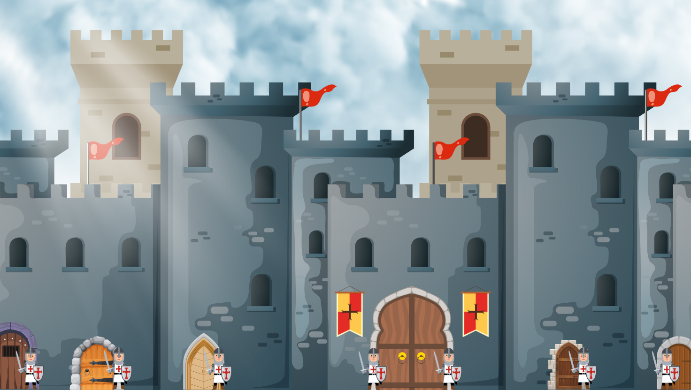
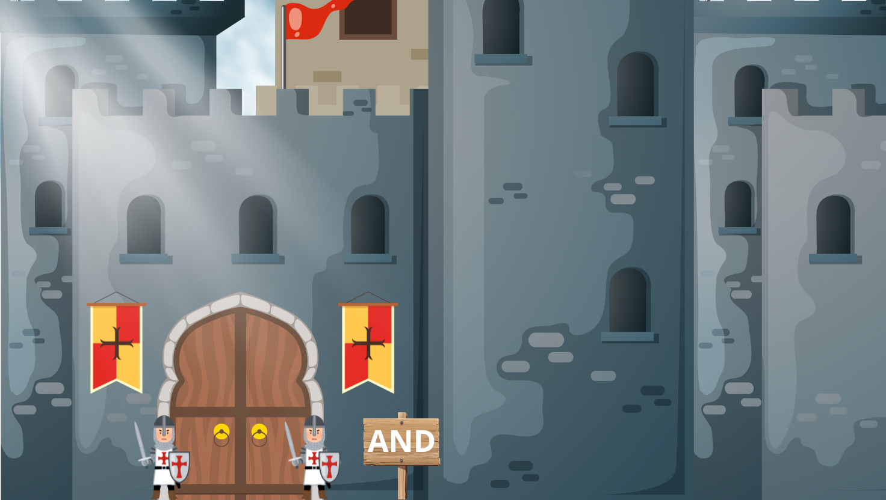
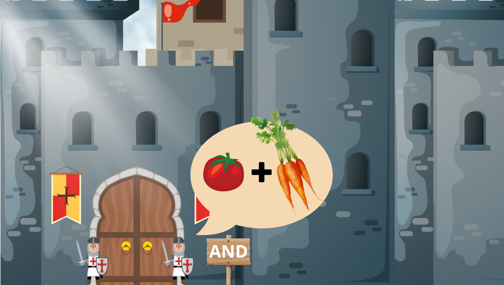

Ecoute l'article :
<audio controls>
  <source src="/lemon-squeezy/audio/porte-logique-and.mp3" type="audio/mpeg">
  Votre navigateur ne supporte pas l'élément audio.
</audio>

Pour commencer ton voyage dans le monde de l'informatique, je te propose de découvrir comment fonctionne ton ordinateur. Si tu aimes jouer à Minecraft, tu as peut être déjà entendu parler des portes logiques. Si ce n'est pas le cas, rassure-toi, je vais t'expliquer ce qui se cache derrière ce nom très mystérieux... et tu vas voir que c'est beaucoup plus simple que ça en a l'air !

Imaginons un grand chateau, avec plusieurs portes. A chaque porte, il y a un garde qui décide si tu as le droit d'entrer ou pas. 

Tu as un passeport magique, qui fonctionne avec des petites lumières, d'accord ? Les lumières de ton passeport sont soit allumées (on va dire que ça fait 1), soit éteintes (on va dire que ça fait 0). 

Les portes du chateau, ce sont des portes "logiques". Elles sont "logiques", parce qu'elles vont vérifier que les lumières de ton passeport sont bien allumées en fonction de leurs règles, et si ce n'est pas le cas, tu ne pourra pas entrer par cette porte là. Pour allumer les lumières de ton passeport, tu dois respecter certaines conditions, des "règles du jeu", en quelque sorte.

Chaque porte logique possède ses propres règles.

## À quoi ça sert ?

Notre chateau, en réalité, c'est ton ordinateur. Ce ne sont pas "vraiment" des vraies portes, mais des composants électroniques qui servent à résoudre des problèmes et à prendre des décisions dans un ordinateur.

Il y a plusieurs types de portes logiques. Je t'explique la première, et ensuite, je ferais un article différent pour chacune, car ce serait un peu trop long de tout lire d'un coup.

### La porte AND (ET)

Sur la première porte de notre chateau, il y a un panneau qui indique **"AND"**. 

Ca veut dire "ET" en Anglais, comme dans "de la vanille **ET** du chocolat" quand tu commandes une glace. 

Imaginons que tu veuilles livrer des légumes aux cuisines du chateau, mais pour pouvoir passer la porte logique de la cuisine, il y a deux conditions :

- 🍅 Tu dois avoir des tomates bien mures (tu en as? la première lumière s'allume : 1)
- 🥕 Tu dois aussi avoir des carottes (c'est ok? la seconde lumière s'allume : 1)

Si ces deux choses sont vraies, alors tu vas pouvoir passer la porte de la cuisine.
Si une seule ou les deux sont fausses (par exemple, s'il n'y avait plus de tomates ou si tu n'as pas trouvé de carottes), ton passeport n'est pas valide (0) et tu ne pourra pas passer la porte logique.

**Règle :** La porte ET dit "on entre dans les cuisines seulement **si ces deux choses sont vraies**".

- Si tes deux lumières sont allumées (1), alors ton passeport est valide et la porte s'ouvre (1).

- Si l'une des deux lumières est éteinte (0), alors ton passeport n'est pas valide et la porte reste fermée (0).

Et voilà, tu connais les règles de ta première porte logique, félicitations !

## La logique combinatoire

C'est avec cette logique, qu'on appelle "logique combinatoire", que ton ordinateur prend des décisions. "Combinatoire" c'est un mot un peu compliqué pour dire quelque chose de simple. Par exemple, si tu appuies sur le bouton A et le bouton B en même temps, ça peut allumer une lumière. Si tu n'appuies que sur un seul des boutons, la lumière ne s'allume pas. C'est ça la logique combinatoire : elle décide de ce qui se passe à partir de ce que tu fais maintenant, sans tenir compte de ce qui s'est passé avant. 

On continue ? Voici les 7 types de portes logiques de base :
- AND (ET) dont on vient de parler ici.
- [OR (OU)](/lemon-squeezy/parcours/porte-logique-or)
- [NOT (NON)](/lemon-squeezy/parcours/porte-logique-not)
- NAND, à venir
- NOR, à venir
- XOR (OU exclusif), à venir
- XNOR, à venir

Tu peux cliquer sur leur nom pour découvrir les règles de chacune de ces portes.

Pour aller plus loin, j'ai ajouté des vidéos dans les ressources (clique sur le lien "ressources" dans le menu, tout en haut du site), et notamment la vidéo de [Codeur Pro sur les portes logiques](https://www.youtube.com/watch?v=iTH39L2d7bg&list=PLLBWkn1N0gl7Bl20PnPx0unIsogGAb9TG&index=5), et [celle-ci, qui crée les portes logiques dans l'univers Minecraft](https://www.youtube.com/watch?v=Hr-RAeyppt0) (clique sur les liens pour voir les vidéos **seulement si tu as le droit d'utiliser Youtube**)