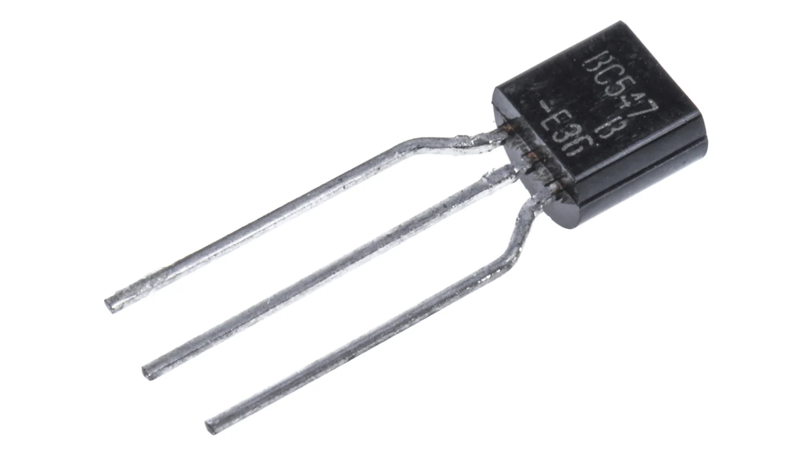
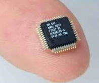
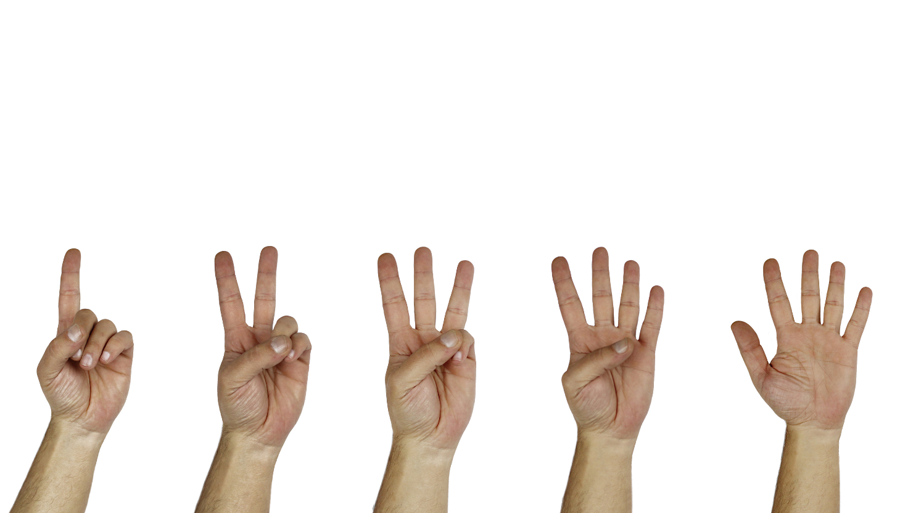
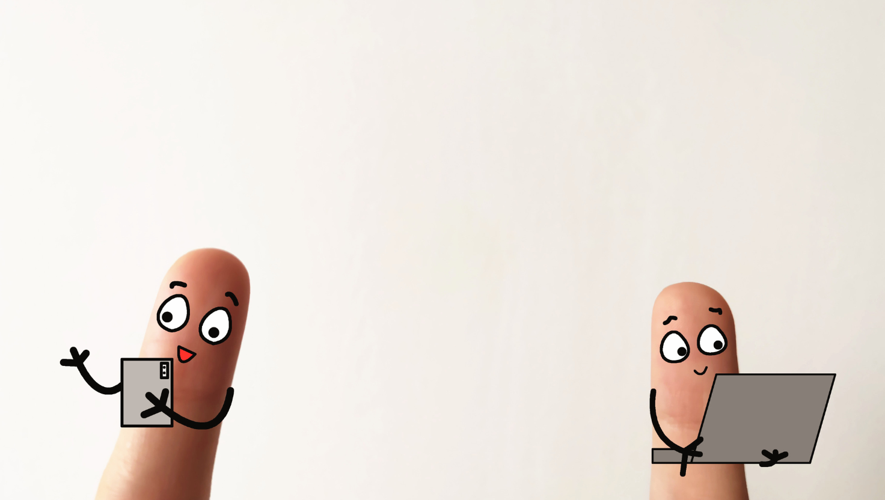
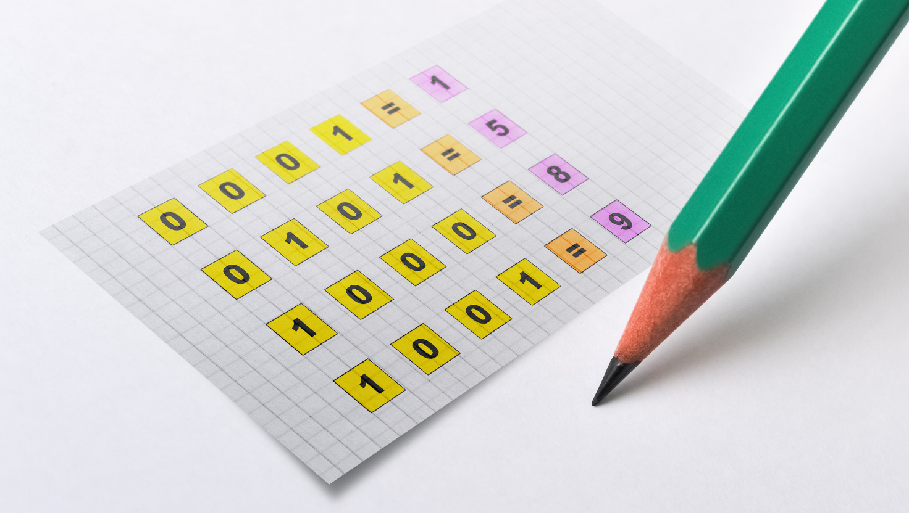
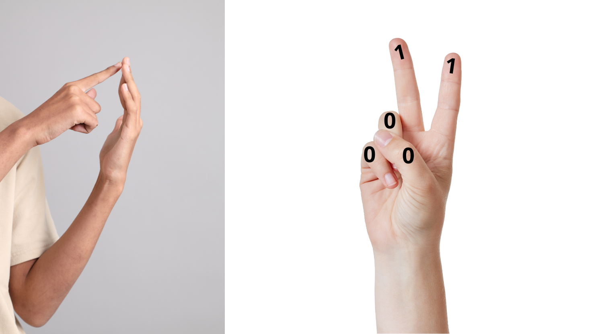

Ecoute l'article :
<audio controls>
  <source src="/lemon-squeezy/audio/systeme-binaire.mp3" type="audio/mpeg">
  Votre navigateur ne supporte pas l'élément audio.
</audio>

## Un interrupteur électronique

Un **transistor**, c'est un tout petit composant de ton ordinateur, qui agit comme un bouton qui allume, ou éteint. Il peut donc allumer ou éteindre un courant électrique, un peu comme un interrupteur pour la lumière de ta maison. Mais lui, il est super rapide et très petit ! Il est composé de matières qu'on appelle "semi conductrices", ça signifie qu'il laisse passer le courant électrique uniquement dans un sens. Dans notre histoire de chateau, il serait le gardien de la porte, celui qui décide si ton passeport est valide ou pas en fonction des règles qu'on lui a confiées.

Pour que tu saches à quoi il ressemble, voici un (gros) transistor :

L'avantage, c'est qu'il est très petit et qu'il ne consomme pas beaucoup d'énergie, alors il peut facilement servir pour fabriquer nos portes logiques. On va le souder sur des petits circuits électroniques qu'on appelle des **puces**. Elles ne ressemblent pas à celles de ton chat, mais a de toutes petites plaques de plastique avec des petits chemins métaliques (pour laisser passer le courant), et des composants comme les transistors soudés dessus. 

Aujourd'hui, une puce électronique ressemble à ça :

Devine combien de transistors il y a dans ce minuscule petit boitier qui mesure moins d'un centimètre ? 
**43 milliards de transistors** !! Quand je te dis qu'ils sont petits, je ne plaisante pas !

C'est avec ces puces que fonctionnent les ordinateurs, les téléphones et les consoles de jeu vidéo (et même les lave-vaisselles, de nos jours !)

## Des 0 et des 1

Si le transistor fonctionne comme un interrupteur qui allume ou éteint... tu reconnais bien là les 0 (éteint) et les 1 (allumé) dont nous avons parlé avec les portes logiques et ton passeport magique ! Et tu as bien raison, car c'est le language de ton ordinateur.

Toi, tu as 10 doigts, alors tu peux compter jusqu'à 10, et recommencer avec 11 jusqu'à 20, puis recommencer avec 21 jusqu'à 30 et ainsi de suite... On appelle ça **"compter en base 10"**, parce que tu prends tes 10 doigts comme base pour construire ton système de comptage. On l'appelle aussi le "**système décimal**", c'est ce que tu apprends à l'école.

Ton ordinateur, lui, il n'a pas de doigts. Il n'a que des transistors. Et les transistors, ça ne peut faire que des 0, et des 1. Ce qui fait donc seulement deux possibilités. Il va donc **"compter en base 2"** ! C'est un peu différent de ta manière de compter à toi. On appelle ça le "**système binaire**".

Quand tu comptes, tu commences avec 1 (alors que ton ordinateur, lui, il commence à compter avec 0 !), puis tu vas jusqu'à 10, et enfin tu reprends le premier doigt pour faire 11. C'est comme si tu faisais une retenue de ta dizaine à chaque fois. L'ordinateur, il va compter jusqu'à 1 en partant du 0, et quand il est arrivé à 1, il repart du 0 (son premier doigt à lui) pour compter la suite. Il va faire sa retenue à 1 au lieu de 10 comme toi tu le ferais.

Regarde comment on écrit les chiffres de 1 à 10 en binaire :

| Décimal (base 10) | Binaire (base 2) |
|-------------------|-----------------|
| 0                | 0               |
| 1                | 1               |
| 2                | 10              |
| 3                | 11              |
| 4                | 100             |
| 5                | 101             |
| 6                | 110             |
| 7                | 111             |
| 8                | 1000            |
| 9                | 1001            |
| 10               | 1010            |

En base 10, on ajoute un chiffre quand on atteint 10 (9 → 10).
En base 2, on ajoute un chiffre quand on atteint 1 (1 → 10).

### Sport de doigts

Compter en binaire, c'est comme compter sur les doigts, mais avec deux positions : plié (0) ou levé (1). Ca fait comme de la gym de doigt, non ?

Avec seulement trois doigts, tu peux compter jusqu'à 7 (000 à 111), et avec dix doigts, tu peux aller jusqu'à 1023 !
En binaire, chaque doigt représente ce qu'on appelle un "**bit**". Un bit, c'est comme une toute petite lumière qui peut être allumée ou éteinte 💡. Ce sont les petites lumières de ton passeport magique !

0 → Éteint (pas de courant ❌)

1 → Allumé (courant qui passe 💡)

C'est la plus petite information qu'un ordinateur peut comprendre.
Avec un seul bit, on peut donc dire oui (1) ou non (0), vrai (1) ou faux (0), on (1) ou off (0).

### Et mes transistors dans tout ça ?

Un transistor permet de stocker ou de traiter un bit. Le bit, c'est la valeur (0 ou 1), le transistor, c'est ce qui va créer et manipuler le bit.

Les ordinateurs utilisent des **milliards de transistors** pour manipuler des bits et faire des calculs. Et le language de ton ordinateur, c'est donc le binaire !

Mais rassure-toi, tu n'as pas besoin de savoir compter en binaire pour coder, heureusement. Sinon, ce serait drôlement long de fabriquer un site internet !!